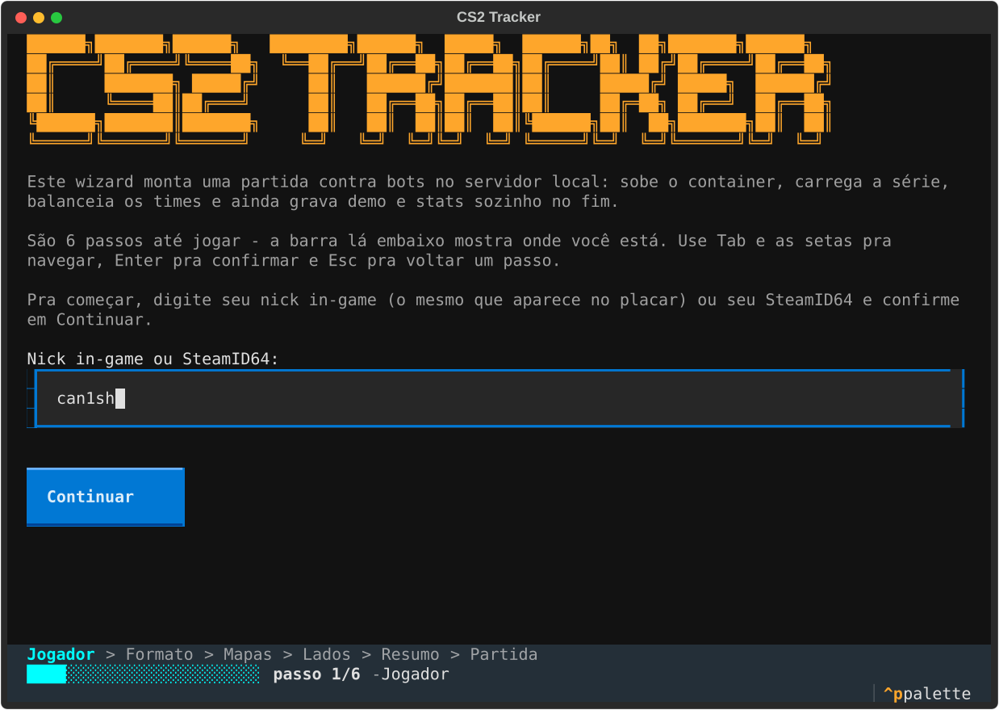
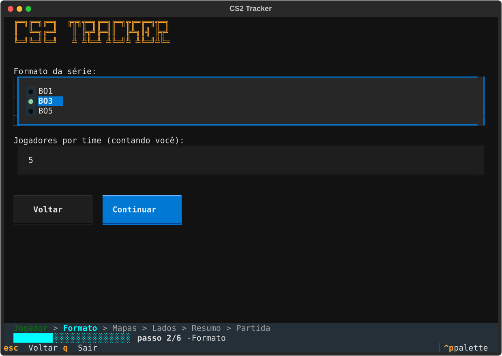
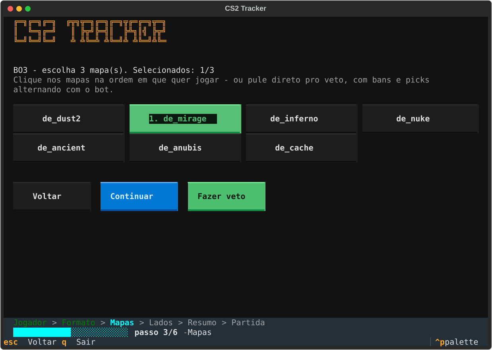
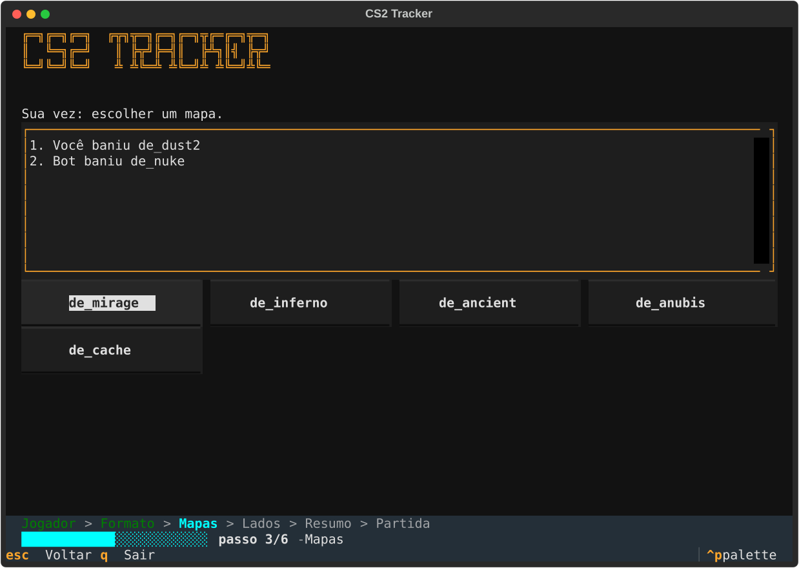
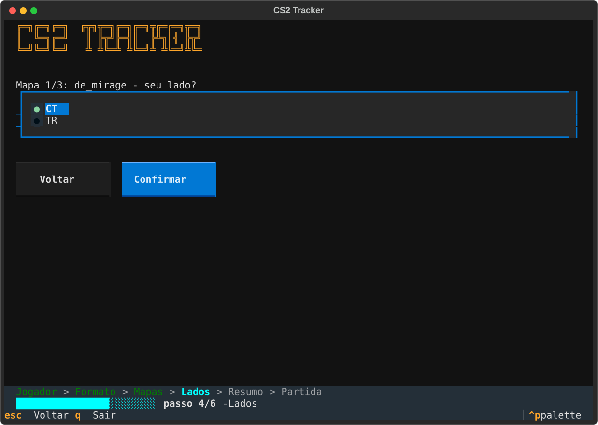
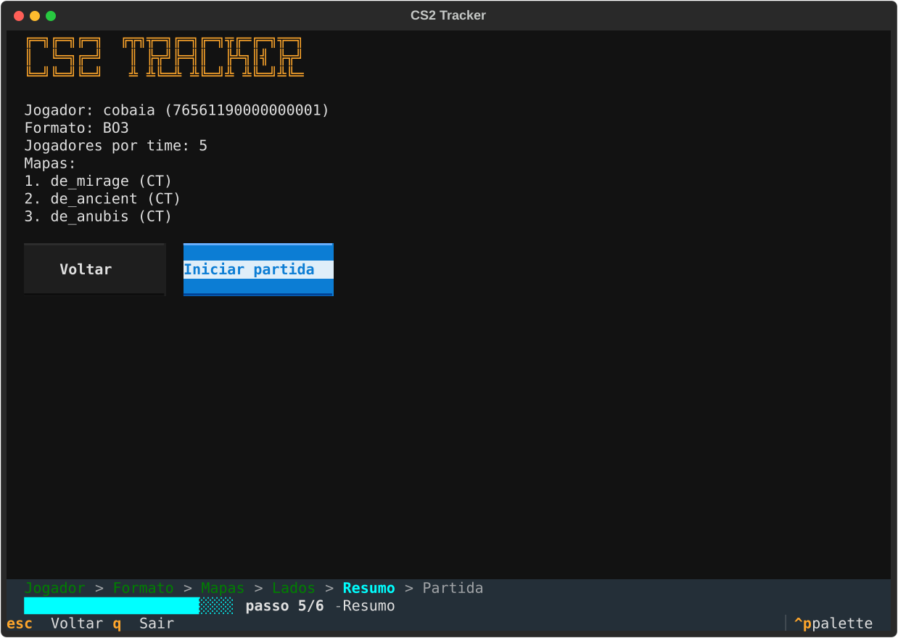
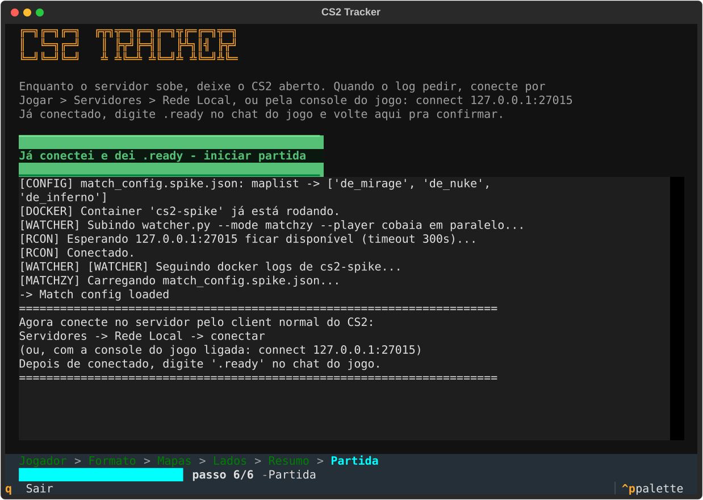

# CS2 Tracker

Sobe um servidor de CS2 local (Docker + MatchZy), monta a partida por um
wizard de terminal, joga contra bots e, no fim, grava demo, stats e um
relatório HTML sozinho.

**Jogar** — sobe o servidor e abre o wizard:

```bash
docker compose up -d
.venv\Scripts\python.exe wizard_tui.py
```

**Ver as estatísticas** — sobe o app web em http://127.0.0.1:8000:

```bash
.venv\Scripts\python.exe -m uvicorn web.app:app
```

Os dois são independentes: dá pra abrir as estatísticas sem o Docker rodando
(o app só lê o `cs2_tracker.db`), e dá pra jogar sem o app web no ar. Ver
[Ver as estatísticas](#7-ver-as-estatísticas).



## O que dá pra fazer

- **Jogar contra bots que se comportam como gente** — o servidor roda o
  [CS2-Bot-Improver](https://github.com/ed0ard/CS2-Bot-Improver), que
  reescreve mira, movimentação e compra dos bots nativos (que sozinhos não
  seguram um round competitivo). O perfil de dificuldade é um arquivo do
  servidor, trocável entre **Low / Medium / High** — ver
  [Bots](#bots-dificuldade-e-comportamento).
- **Séries BO1, BO3 ou BO5 com veto de mapa** — bans e picks alternando com
  o bot sobre o pool competitivo de 7 mapas, decider incluso. Se preferir,
  dá pra escolher os mapas na mão e pular o veto.
- **Lado por mapa** — CT ou TR em cada mapa da série, escolhido antes da
  partida carregar (a MatchZy trava a troca pelo menu do jogo, então isso
  precisa vir do match config).
- **Times balanceados de verdade** — 1x1 até 5x5, com os bots distribuídos
  por lado via RCON (a divisão automática da engine erra quando já tem um
  humano ocupando um time).
- **Stats e relatório automáticos** — ao fim da partida a demo é parseada
  com awpy, os dados vão pro SQLite e o `report.html` é regenerado sem você
  rodar nada.

## Como configurar e rodar

### Pré-requisitos

| O quê | Por quê |
|---|---|
| [Docker Desktop](https://www.docker.com/products/docker-desktop/) | roda o servidor dedicado + MatchZy |
| Python `>=3.11,<3.14` | o awpy 2.x não suporta 3.14+ (`py -0` lista o que você tem) |
| CS2 instalado | é o client que vai conectar no servidor local |

### 1. Ambiente Python (uma vez)

```bash
py -3.13 -m venv .venv
.venv\Scripts\python.exe -m pip install -r requirements.txt
```

Todo comando daqui pra frente roda por esse `.venv`, não pelo Python do
sistema.

### 2. Variáveis de ambiente (uma vez)

Copie `.env.example` pra `.env` (git-ignored) e preencha:

```ini
SRCDS_TOKEN=...       # token de game server: https://steamcommunity.com/dev/managegameservers
CS2_RCONPW=...        # qualquer senha local; o wizard recusa subir com o placeholder
MATCHZY_ADMINS=...    # seu SteamID64 (https://steamid.io) — vira admin do MatchZy
```

Coloque o mesmo SteamID64 em `docker/match_config.spike.json` (campo
`team1.players`) pra o wizard conseguir casar seu nick com o seu ID.

### 3. Subir o servidor

```bash
docker compose up -d
```

A primeira subida baixa a imagem e os arquivos do CS2 — leva vários minutos.
Confira que está de pé antes de seguir:

```bash
docker logs --tail 20 cs2-spike
```

O servidor escuta em `27015` (TCP pro RCON, UDP pro jogo) e `27020/UDP`
(GOTV). `CS2_MAXPLAYERS=11` é o teto atual: 5x5 mais um slot do GOTV — pra
jogar 6x6 você precisa subir esse valor no `docker-compose.yml` e recriar o
container.

### 4. Rodar o wizard

```bash
.venv\Scripts\python.exe wizard_tui.py
```

São 6 passos, e a barra no rodapé mostra em qual você está. Em qualquer um
deles dá pra voltar com `Esc` ou com o botão **Voltar**.

**Passo 1 — Jogador.** Seu nick in-game (o mesmo do placar) ou seu
SteamID64. É o que liga a partida aos seus stats.


**Passo 2 — Formato.** BO1, BO3 ou BO5, e quantos jogadores por time
(contando você). O wizard valida contra o `CS2_MAXPLAYERS` do compose antes
de deixar seguir.



**Passo 3 — Mapas.** Escolha os mapas na ordem em que quer jogar (a ordem do
clique vira a ordem da série) ou clique em **Fazer veto**.



**Passo 3 — Veto.** Bans e picks alternando com o bot, com o histórico
completo na tela e um timer visível antes de cada jogada dele. O que sobrar
depois dos bans finais é o mapa decisivo.



**Passo 4 — Lados.** CT ou TR, um mapa por vez.



**Passo 5 — Resumo.** Última conferida antes de subir a partida.



**Passo 6 — Partida.** O wizard escreve o match config, carrega a série no
servidor e sobe o watcher. Launcher e watcher escrevem no mesmo painel, então
é só acompanhar essa tela.



### 5. Conectar no servidor

Quando o log mostrar `Agora conecte no servidor`, entre no CS2 e conecte:

- **Jogar → Servidores → Rede Local**, ou
- pela console do jogo (ative em Configurações → Jogo → *Ativar console de
  desenvolvedor*): `connect 127.0.0.1:27015`

Já dentro do servidor, digite `.ready` no chat do jogo e volte pro wizard.

### 6. Iniciar

Clique em **Já conectei e dei .ready — iniciar partida**. O wizard força o
início (`css_start`), enche os times com a quantidade exata de bots por lado
e devolve o controle pra você. Daí é jogar.

Ao fim da partida o watcher detecta o fim, ingere os dados no
`cs2_tracker.db` e regenera os HTMLs estáticos — sem precisar de nenhum
comando. Pra ver o resultado, [suba o app web](#7-ver-as-estatísticas) ou abra
o arquivo estático:

```bash
start report.html
```

Pra encerrar, `q` no wizard (ele mata o watcher junto).

### 7. Ver as estatísticas

O app web é um processo separado do servidor de jogo. Não precisa do Docker
no ar: ele só lê o `cs2_tracker.db`, então funciona depois de fechar tudo.

```bash
.venv\Scripts\python.exe -m uvicorn web.app:app
```

Abre em **http://127.0.0.1:8000**. Acrescente `--reload` se estiver mexendo
no código (reinicia sozinho a cada alteração) e `--port 8010` se a 8000
estiver ocupada.

| Rota | O que mostra |
|---|---|
| `/` | Home: últimas partidas, melhor mapa, arma mais letal, melhor lado |
| `/partidas` | Todas as partidas, com filtro por mapa e por lado |
| `/partidas/<id>` | Uma partida: Resumo · Rounds · Armas · Duelos · Mapa · Feed |
| `/setup` | Monta a partida pelo navegador (não inicia — ver limitação abaixo) |
| `/lineups`, `/maps` | Escolha de adversários e de mapas |
| `/report` | Relatório antigo, numa página só |

A aba **Mapa** do detalhe só aparece nas partidas que têm posição gravada; a
de **economia** por round, nas que têm o loadout do fim do freeze time. Nem
toda partida antiga tem — depende de como ela foi ingerida.

**Limitação**: o `/setup` vai até o Resumo, mas **não inicia a partida**. Pra
jogar de verdade continua sendo o `wizard_tui.py` (ou o `start_match.py`).

## Plugins do servidor

Tudo já vem embutido na imagem [`xbird/cs2-matchzy`](https://hub.docker.com/r/xbird/cs2-matchzy)
(baseada em [joedwards32/cs2](https://github.com/joedwards32/CS2)). As três
versões abaixo estão **fixadas** no `docker-compose.yml` porque a imagem
busca `latest` a cada boot, e um Metamod mais novo (interface 18) já quebrou
todos os plugins compilados pra interface 17 (`[META] Loaded 0 plugins.`,
com `matchzy_loadmatch`/`css_start` virando "Unknown command").

| Plugin | Versão | Papel |
|---|---|---|
| [Metamod:Source](https://www.sourcemm.net/) | `2.0.0.1411` | camada de plugins da engine |
| [CounterStrikeSharp](https://github.com/roflmuffin/CounterStrikeSharp) | `v1.0.373` | runtime .NET pros plugins |
| [MatchZy](https://github.com/shobhit-pathak/MatchZy) | `0.8.15` | partidas competitivas: match config, séries, demo e CSV de stats |
| [CS2-Bot-Improver](https://github.com/ed0ard/CS2-Bot-Improver) | embutida | comportamento, mira e compra dos bots |
| [DefaultAgents-CS2](https://github.com/srwiruwiru/DefaultAgents-CS2) | versionado em `docker/plugins/` | **desligado** — ver abaixo |

O DefaultAgents-CS2 forçaria todo mundo a usar o agente default sem mexer em
skin de arma/faca/luva, mas está desativado: testado ao vivo, ele trava o
load de um recurso de modelo (`RESOURCE_TYPE_MODEL B6EC56677600A473 "not
resident"` no log do client), o viewmodel da arma renderiza gigante/quebrado
e falta uma textura no HUD. O bug sumiu ao desativar e voltou ao reativar.
Pra religar (por sua conta e risco), descomente o volume dele no
`docker-compose.yml` e recrie o container.

## Bots: dificuldade e comportamento

O CS2-Bot-Improver **ignora os cvars nativos** (`bot_difficulty`,
`custom_bot_difficulty`): ele lê um arquivo estático,
`game/csgo/overrides/botprofile.vpk`, carregado só na subida do processo do
jogo. Ou seja, não dá pra trocar por RCON em runtime nem pelo wizard — e por
isso os `bot_*` em `server-configs/cfg/gamemode_competitive_server.cfg`
valem pra quota e padrão de compra, mas não pra dificuldade.

**O dedicated server não monta esse VPK sozinho.** O `overrides/botprofile.vpk`
existir no lugar certo não basta — o `srcds` headless nunca registra esse
arquivo como search path (só listen server/client parecem fazer isso
automaticamente). Sem o fix, `bot_add_ct` com qualquer nome do VPK (inclusive
os perfis pro) falha com `Error - no profile for '<nome>' exists.`, mesmo com
o arquivo válido e presente — só os ~20 nomes stock da Valve funcionam.
`docker/pre.sh` corrige isso: a imagem já roda esse hook depois do `steamcmd`
e antes de subir o servidor, e nosso `pre.sh` insere a entrada que falta no
`gameinfo.gi` (idempotente, roda em todo boot). Detalhe completo e evidência
em [docs/SPEC.md §10](docs/SPEC.md) (Passo 0).

A imagem já traz as três variantes em `overrides/{Low,Medium,High}/`. Este
projeto fixa **Low**. Pra trocar:

**Pare o servidor ANTES de copiar.** O jogo mantém o VPK mapeado em memória
enquanto roda; sobrescrever o arquivo por baixo de um processo vivo derruba o
servidor com `FATAL ERROR: Error reading from loaded packed store` seguido de
`Segmentation fault` (reproduzido em 26/09/2026). O processo volta sozinho e o
perfil novo passa a valer, mas a partida em andamento morre junto.

```bash
docker stop cs2-spike
docker run --rm -v cs2-tracker_cs2-data:/d alpine cp /d/game/csgo/overrides/Medium/botprofile.vpk /d/game/csgo/overrides/botprofile.vpk
docker start cs2-spike
```

Troque `Medium` por `High` pro perfil mais agressivo. Na prática: `Low`
segura um round casual, `Medium` chega perto de um jogo competitivo online e
`High` é o mais próximo de um nível "pro" que os bots do CS2 alcançam.

## Estrutura do repositório

```
wizard_tui.py                                    # o wizard (Textual) — porta de entrada
wizard_core.py                                   # lógica do wizard (veto, match_config) — sem UI
start_match.py                                   # docker up + RCON + matchzy_loadmatch + bots
watcher.py                                       # segue o log do servidor, dispara o parser
parser.py                                        # awpy -> SQLite
stats.py                                         # SQLite -> dict — cálculo puro, sem HTML, usado por report.py e home.py
report.py                                        # stats.py -> report.html (dashboard + detalhe de partida)
home.py                                          # stats.py -> index.html (tela inicial, ver docs/features/M3.5-home.md)
templates/                                       # Jinja: shell.html (header/CSS compartilhado), home.html, report.html
static/                                          # escudos, ícones de mapa/arma servidos pelos HTMLs gerados
config.py                                        # paths/defaults compartilhados (.env)
identity.py                                      # resolve nick/SteamID64 do jogador humano
tools/make_screenshots.py                        # regenera os prints de docs/img/
docker-compose.yml                               # servidor MatchZy em container
docker/match_config.spike.json                   # match config reescrito a cada partida
docker/plugins/                                  # plugins CounterStrikeSharp versionados aqui
server-configs/cfg/                              # cfgs do servidor dedicado NATIVO (ver abaixo)
docs/img/                                        # prints do wizard usados neste README
demos/                                           # .dem já parseados, arquivados (git-ignored)
cs2_tracker.db                                   # SQLite gerado pelo parser (git-ignored)
report.html, index.html                          # gerados pelo watcher a cada partida (git-ignored)
```

Toda a lógica de negócio do wizard vive em `wizard_core.py`, sem nenhum
import de Textual — `wizard_tui.py` é só a casca visual, então trocar de UI
no futuro significa reescrever só esse arquivo.

Os prints deste README são SVGs gerados a partir do próprio wizard rodando
headless; depois de mexer na TUI, regenere com:

```bash
.venv\Scripts\python.exe tools/make_screenshots.py
```

## Parser / banco de dados

`parser.py` lê o `.dem` com awpy e grava em `cs2_tracker.db` (SQLite,
git-ignored):

| Tabela | Conteúdo |
|---|---|
| `matches` | 1 linha por partida — mapa, placar, duração, caminho do demo, nome do jogador |
| `rounds` | round a round — vencedor, motivo, plant de bomba |
| `kills` | quem matou quem, arma, headshot, distância (`attacker_is_human`/`victim_is_human` marcam se é você) |
| `damages` | dano por evento, com os mesmos flags `*_is_human` (dá pra computar ADR agrupando por round) |
| `player_positions` | posição tick a tick — **só do jogador humano** (`--player`) |

**TODO conhecido**: economia/compra (dinheiro gasto por round) fica de
fora por ora — o awpy 2.0.2 não expõe um dataframe de compra com valor
monetário, só o evento `item_pickup` sem o dado de dinheiro. Revisitar se
uma versão futura do awpy cobrir isso.

Pra reprocessar uma demo manualmente (sem precisar do watcher rodando):
```bash
.venv\Scripts\python.exe parser.py "C:/cs2server/game/csgo/20260902_202208_de_mirage.dem" --map de_mirage --score-ct 1 --score-t 13 --minutes 19 --player seu_nick_in_game --db cs2_tracker.db
```

## Relatório e Home

`report.py` e `home.py` leem o mesmo `cs2_tracker.db` através de `stats.py` (a
camada de cálculo — SQLite -> dict, sem HTML nenhum) e cada um gera seu próprio
`.html` estático local (sem servidor, sem build; o relatório embute os dados
como JSON inline, a home é renderizada direto no servidor via Jinja). Os dois
compartilham cabeçalho, navegação e paleta (`templates/shell.html`) e os
assets em `static/`. O `watcher.py` já regenera os dois arquivos sozinho ao
fim de cada partida; rode manualmente só se quiser reprocessar fora desse
fluxo:

```bash
.venv\Scripts\python.exe report.py --db cs2_tracker.db --out report.html --open
.venv\Scripts\python.exe home.py --db cs2_tracker.db --out index.html
```

`index.html` (a home) resume as 5 últimas partidas, melhor mapa, arma mais
letal e melhor lado (CT/TR) com dado real — ver
[docs/features/M3.5-home.md](docs/features/M3.5-home.md) pro desenho completo
e o que ainda depende do app web (M3) pra existir (início de partida em 1
clique, launcher, escudo por adversário).

O `.html` tem duas telas, navegadas em JS puro via `location.hash` (sem
recarregar a página):

- **Dashboard** (`report.html`): cards agregados (K/D, ADR, HS%, round
  win rate), gráfico de evolução por partida, e a lista de partidas —
  clique numa linha pra abrir o detalhe.
- **Detalhe da partida** (`report.html#match-<id>`): quadro de armas
  (kills/headshots/dano por arma), linha do tempo round a round (quem
  venceu, motivo, plant de bomba, seu K/D naquele round) e o feed
  cronológico de kills/mortes.

Round win rate compara o lado do jogador humano em cada round (via
`player_positions`) com `rounds.winner_side`, em vez de só olhar o
placar final — necessário porque os lados trocam na metade da partida.

Toda estatística (cards, quadro de armas, linha do tempo, feed) vem em
**3 variantes** — Geral / CT / TR —, trocadas por um toggle no topo da
página, tanto no dashboard quanto no detalhe da partida. CT + TR sempre
somam exatamente igual a Geral. Se você só jogou 1 ou 2 rounds de um
lado numa partida (ex.: virada de metade cedo), o toggle daquele lado
mostra só esses rounds — armas, linha do tempo e feed todos recortados
igual.

**Limitação, só no relatório antigo**: ali o quadro de armas separa a mesma
arma em duas linhas (ex.: "M4A1-S" com kills e "M4A4" com dano) — o evento de
kill e o de dano do CS2 usam nomes internos diferentes pras variantes com e
sem silenciador. As telas novas (`/partidas/<id>`) reconciliam isso em
`stats.WEAPON_CANONICAL` e mostram o par junto ("M4A4 / M4A1-S"), já que o
dado não permite separar os dois de verdade.

## Fluxos alternativos

### CLI, sem wizard (`start_match.py`)

Mesma orquestração do wizard, com flags em vez de telas — útil pra repetir
uma configuração ou automatizar:

```bash
docker compose up -d
.venv\Scripts\python.exe start_match.py --player seu_nick_in_game --map de_inferno --side ct --team-size 5
```

Aqui o `input()` de "pressione Enter quando estiver conectado" é o do
terminal mesmo, e a saída do watcher (subido junto por causa do `--player`)
sai no mesmo terminal. Sem `--player`, o script deixa a partida pronta e
você roda o watcher à mão em outra janela:

```bash
.venv\Scripts\python.exe watcher.py --mode matchzy --player seu_nick_in_game --debug
```

O gatilho de fim de partida é a linha de log
`[MatchZy] [WritePlayerStatsToCsv] ...` (só ela é confiável — ver comentário
de `MATCHZY_PATTERNS` em `watcher.py`), disparada quando o MatchZy já
terminou de gravar `docker/demos-live/<matchid>_<mapa>_<time1>_vs_<time2>.dem`.
O watcher localiza essa demo pelo `matchid`, parseia com awpy e regenera o
`report.html` — placar e duração são calculados a partir do próprio `.dem`
(o CSV do MatchZy não tem placar por round).

### Servidor dedicado nativo (sem Docker)

Fluxo anterior ao Docker, mantido porque ainda funciona. Não tem MatchZy:
sem veto, sem série, sem CSV de stats — o watcher fala direto com o servidor
por RCON e grava a demo via GOTV.

1. Baixe o [SteamCMD](https://developer.valvesoftware.com/wiki/SteamCMD) e
   os arquivos do servidor (pasta separada do client normal):
   ```bash
   steamcmd.exe +force_install_dir C:/cs2server +login anonymous +app_update 730 validate +quit
   ```

2. Copie os dois `.cfg` deste repo pra dentro da instalação do servidor
   (**não** do client), trocando `CHANGE_ME_LOCAL_ONLY` por uma senha real:

   | Arquivo neste repo | Destino |
   |---|---|
   | `server-configs/cfg/server.cfg` | `C:/cs2server/game/csgo/cfg/server.cfg` |
   | `server-configs/cfg/gamemode_competitive_server.cfg` | `C:/cs2server/game/csgo/cfg/gamemode_competitive_server.cfg` |

   `gamemode_competitive_server.cfg` existe como arquivo separado (e não
   dentro do `server.cfg`) por um motivo específico: o CS2 executa o config
   interno do modo competitivo *depois* do `server.cfg`, então qualquer
   `bot_quota`/`bot_difficulty`/etc. colocado no `server.cfg` diretamente é
   sobrescrito. `gamemode_competitive_server.cfg` é o hook que a engine
   chama *depois* desse config interno, dando a última palavra pra essas
   cvars.

3. Suba o servidor:
   ```bash
   C:/cs2server/game/bin/win64/cs2.exe -dedicated -console -usercon -condebug -conclearlog +map de_mirage +exec server.cfg +ip 0.0.0.0
   ```
   - `+ip 0.0.0.0` é obrigatório: sem isso o RCON bind fica preso no IP da
     rede local (ex.: `192.168.x.x`) em vez de aceitar `127.0.0.1`.
   - `-condebug -conclearlog` geram o `console.log` que o watcher lê, em
     `game/csgo/console.log` (caminho fixo, não customizável na Source 2).

4. Confirme que o TCP abriu (não só UDP):
   ```powershell
   netstat -ano | findstr "27015"
   ```
   Espera `TCP 0.0.0.0:27015 ... LISTENING`.

5. Rode o watcher em modo nativo, conecte pelo client e jogue:
   ```bash
   .venv\Scripts\python.exe watcher.py --log "C:/cs2server/game/csgo/console.log" --server-demo-dir "C:/cs2server/game/csgo" --demo-dir ./demos --player seu_nick_in_game --rcon-host 127.0.0.1 --rcon-password sua_senha --debug
   ```

   `--server-demo-dir` é a pasta `game/csgo` do servidor **dedicado** (onde
   o GOTV grava o `.dem` de verdade) — normalmente a mesma pasta de `--log`.
   `--player` é o seu nick in-game, usado pra filtrar a posição/heatmap só
   pra você. Use `--debug` pra calibrar os regexes em `PATTERNS` e
   `--print-only` como fallback manual (imprime o comando em vez de mandar
   via RCON).

### Por que servidor dedicado (e não "Practice with Bots")

RCON **não funciona** em listen server / partida offline via menu do CS2 —
confirmado via `netstat` (só abre UDP, nunca o TCP que RCON precisa), mesmo
com `rcon_password` e `-usercon` configurados. É limitação da engine, não
erro de configuração. Por isso todo fluxo aqui assume um servidor dedicado.

## Gotchas já resolvidos

- **`log on`**: sem isso, o servidor não escreve `World triggered "..."`
  nem `Game Over: ...` no log — nem aparecem como linha não reconhecida,
  simplesmente não existem no arquivo.
- **`record`/`stop` não existem em servidor dedicado**: são comandos de
  client. Gravação server-side é via GOTV (`tv_record`/`tv_stoprecord`),
  que é o que o script usa.
- **Auto-exec de `.cfg` no CS2 é instável**: force com `+exec server.cfg`
  na linha de comando em vez de confiar no auto-load.
- **`con_logfile` não existe mais** (era CS:GO/Source 1) — o caminho do
  log é sempre `game/csgo/console.log`, sem opção de customizar.
- **`bot_quota_mode fill` não divide certo com 1 humano** (observado: 4x5
  em vez de 5x5) — por isso o `start_match.py` zera os bots e adiciona a
  quantidade exata por lado, intercalando CT/TR com o autobalance desligado.
- **Balancear bots antes do `css_start` não adianta**: o `css_start` executa
  o `MatchZy/live.cfg`, que zera `bot_quota`. O ajuste tem que vir depois.
